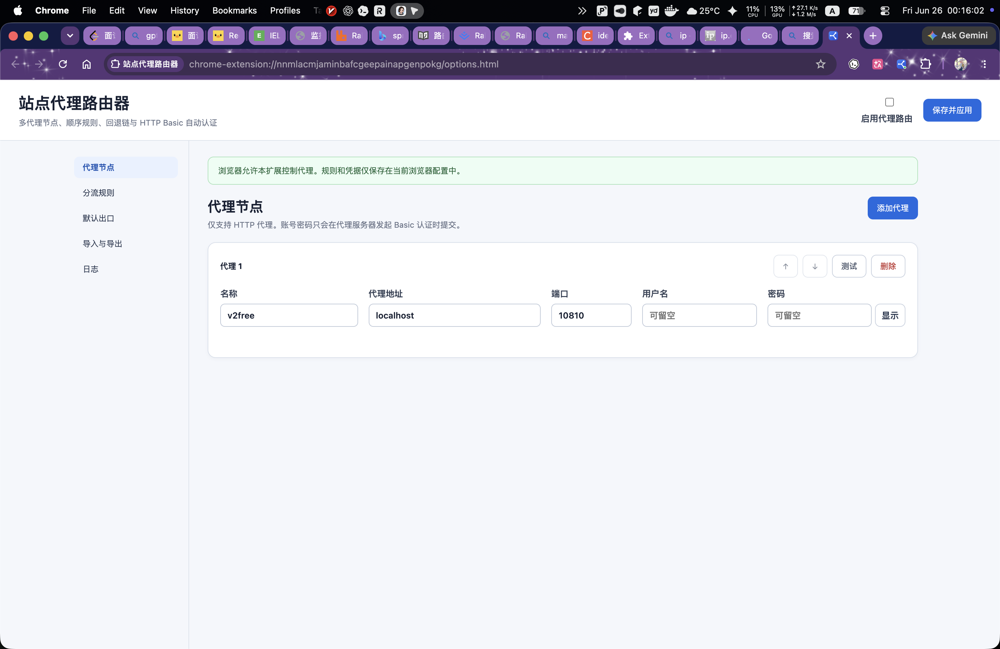
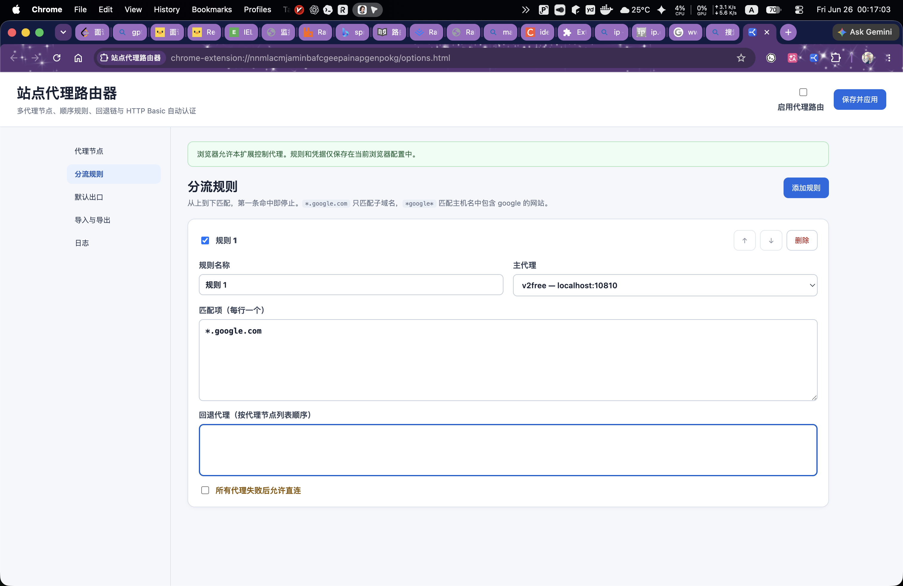
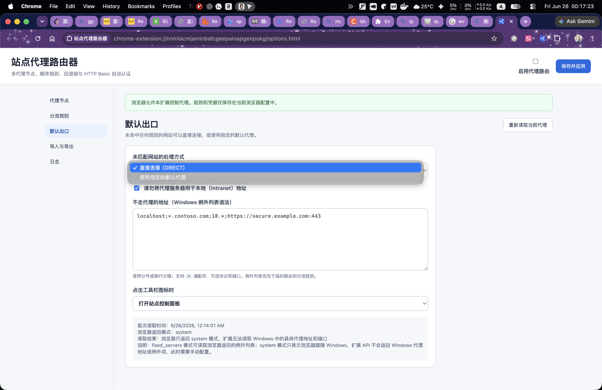
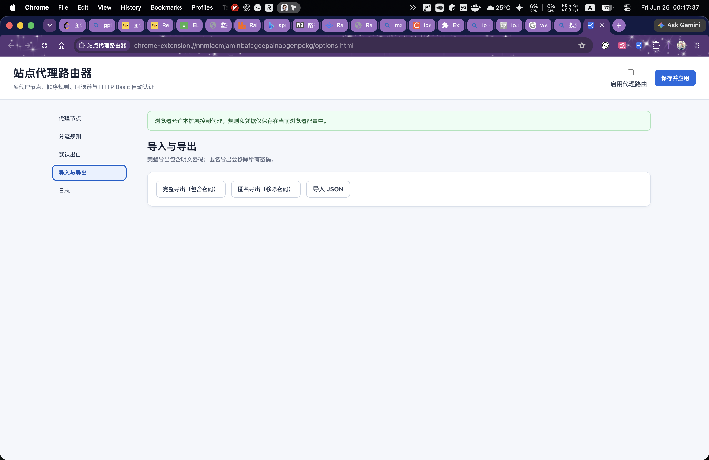
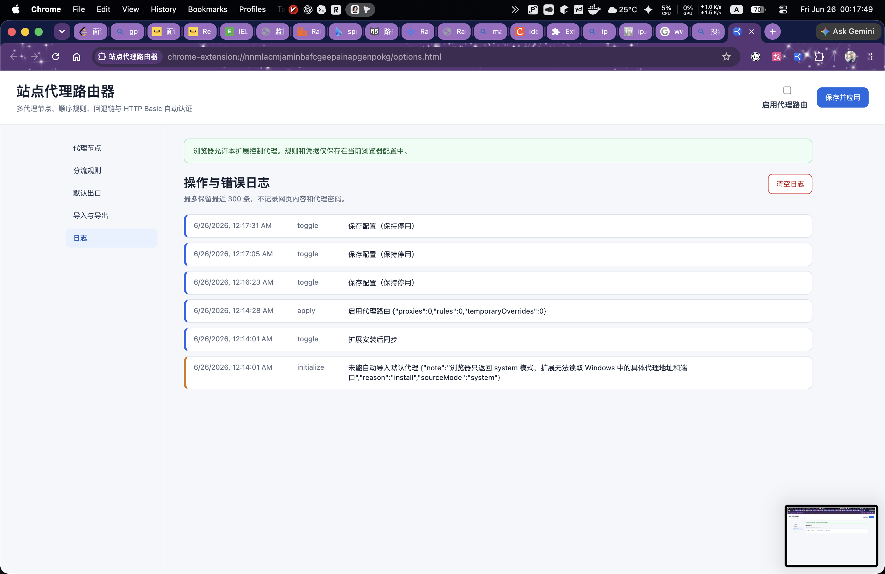
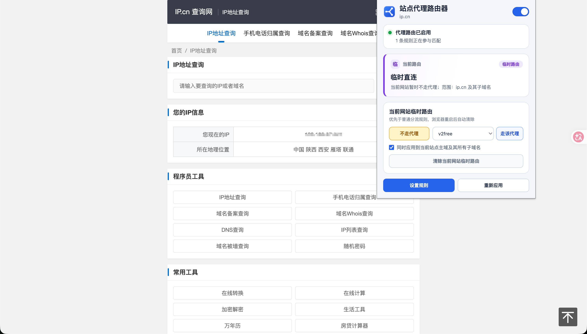
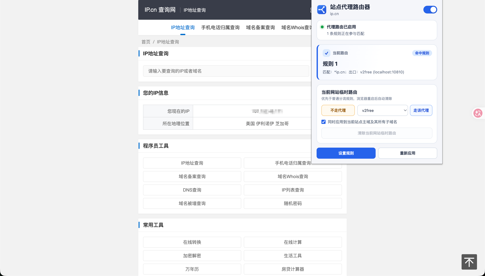

<p align="center">
  
</p>

<h1 align="center">站点代理路由器</h1>

<p align="center">
  面向 Chrome 与 Microsoft Edge 的网站级 HTTP 代理分流扩展。
  <br>
  为不同网站选择不同代理，未匹配网站可选择直接连接或使用指定默认代理。
</p>

<p align="center">
  
  
  
  
</p>

---

## 项目简介

站点代理路由器是一个基于 Chrome Extension Manifest V3 开发的浏览器扩展。它通过 PAC 规则按照网站主机名进行分流，适合以下场景：

- `a.example.com`、`b.example.com` 走代理 A；
- `c.example.com`、`d.example.com` 走代理 B；
- 未命中的网站可选择 `DIRECT` 直连，或走指定的默认代理；
- 内网地址、指定域名或 IP 地址直接连接；
- 某个代理失败后自动尝试备用代理；
- 临时让当前站点直连，或临时切换到指定代理。

扩展只修改 Chrome/Edge 内部的代理配置，不会修改 Windows 全局代理，也不会影响 Git、Java、终端或其他桌面程序。
## 界面预览

1.代理节点



2.分流规则



3.默认出口



4.导入导出



5.日志



6.弹窗






## 功能特性

### 多代理节点

- 可添加任意数量的 HTTP 代理节点；
- 每个节点可配置名称、主机、端口、用户名和密码；
- 支持 HTTP Basic 代理认证；
- 支持代理节点连通性测试；
- 同一条规则可配置主代理和多个回退代理。

### 网站分流规则

- 一个规则组可包含多个网站匹配项；
- 规则从上到下匹配，第一条命中后停止；
- 每条规则可单独启用或停用；
- 支持调整规则顺序；
- 支持精确匹配、子域名通配符和模糊匹配；
- 未匹配网站可配置为 `DIRECT`，或选择一个代理节点作为默认代理。

### Windows 风格的代理绕过

- 支持“不走代理的地址”列表；
- 支持分号或换行分隔；
- 支持 `*` 通配符；
- 支持协议和端口限制；
- 默认支持“请勿将代理服务器用于本地地址”，语义等价于 Windows 的 `<local>`。

### 临时路由

- 当前网站临时直连；
- 当前网站临时走指定代理；
- 默认同时覆盖当前站点主域及其所有子域名；
- 可选择仅对当前精确主机生效；
- 支持网页右键菜单；
- 临时规则在浏览器重启、扩展重载或升级后自动清除。

### 配置与状态

- 显示当前网站命中的规则、匹配项和出口；
- 使用醒目的状态卡区分不走代理、临时路由、分流规则和默认代理；
- 工具栏图标支持控制面板模式或一键启停模式；
- 支持完整导出、匿名导出和配置导入；
- 匿名导出不会包含代理密码；
- 导入成功后立即保存并应用；
- 支持操作日志、认证错误和代理错误日志；
- 最多保留 300 条日志。

## 路由优先级

请求按以下顺序决定出口：

```text
1. 当前会话的临时路由
2. 不走代理列表
3. 已启用的分流规则（从上到下，第一条命中）
4. 未匹配网站出口：`DIRECT` 或默认代理及其回退链
```

如果一个地址已经命中“不走代理列表”，默认会直接连接；但你仍可以在弹窗或右键菜单中设置临时路由，临时路由会在当前会话内覆盖该直连结果。

## 安装方式

当前版本可通过开发者模式加载。

### Google Chrome

1. 下载或克隆本项目；
2. 打开 `chrome://extensions/`；
3. 开启右上角的“开发者模式”；
4. 点击“加载已解压的扩展程序”；
5. 选择包含 `manifest.json` 的扩展目录。

### Microsoft Edge

1. 下载或克隆本项目；
2. 打开 `edge://extensions/`；
3. 开启“开发人员模式”；
4. 点击“加载解压缩的扩展”；
5. 选择包含 `manifest.json` 的扩展目录。

升级旧版本时，可以用新文件替换原扩展目录，然后在扩展管理页面点击“重新加载”。升级前建议先导出配置。

## 快速开始

### 1. 添加代理节点

进入扩展的配置页面，添加至少一个 HTTP 代理节点：

```text
名称：代理 A
主机：proxy-a.example.com
端口：8080
用户名：可选
密码：可选
```

还可以继续添加：

```text
名称：代理 B
主机：proxy-b.example.com
端口：3128
```

### 2. 设置未匹配网站的出口

对于未命中绕过列表、临时路由和普通分流规则的网站，可以选择以下两种处理方式：

- `DIRECT`：直接连接，不使用代理；
- 默认代理：选择一个代理节点作为默认出口。

当选择默认代理时，还可以配置回退链，例如：

```text
默认代理 A → 备用代理 B
```

当未匹配网站选择默认代理时，默认不允许在代理全部失败后最终直连，以避免产生意外直连流量。

### 3. 添加分流规则

示例：让 A、B 网站走代理 A，并在失败后尝试代理 B。

```text
规则名称：A 和 B 网站
匹配项：
  a.example.com
  *.b.example.com
主代理：代理 A
回退代理：代理 B
最终允许直连：关闭
```

示例：让 C、D 网站走代理 B。

```text
规则名称：C 和 D 网站
匹配项：
  c.example.com
  d.example.com
主代理：代理 B
最终允许直连：关闭
```

## 网站匹配语法

匹配只针对 URL 的主机名，不针对路径，且不区分大小写。

| 写法 | 含义 | 示例结果 |
|---|---|---|
| `google.com` | 只匹配精确主机 | 匹配 `google.com`，不匹配 `www.google.com` |
| `*.google.com` | 匹配所有子域名 | 匹配 `mail.google.com`、`a.b.google.com`，不匹配 `google.com` |
| `*google*` | 主机名模糊匹配 | 匹配 `google.com`、`googleapis.com`、`not-google.example` |

为防止某条普通规则意外覆盖所有网站，不允许单独填写：

```text
*
```

规则从上到下匹配。例如：

```text
1. api.example.com → 代理 B
2. *.example.com   → 代理 A
```

访问 `api.example.com` 时会使用代理 B。

## 不走代理的地址

“不走代理的地址”使用接近 Windows/Edge 的代理例外语法。

多个条目可使用分号或换行分隔：

```text
localhost;
*.internal.example.com;
10.*;
https://secure.example.com:443
```

常见写法：

| 写法 | 匹配行为 |
|---|---|
| `example.com` | 只匹配精确主机 `example.com` |
| `*.example.com` | 匹配所有子域名，但不匹配根域名 |
| `.example.com` | 等价于 `*.example.com` |
| `*example*` | 对主机名进行模糊匹配 |
| `10.*` | 匹配 URL 中直接使用的对应 IP 地址 |
| `https://example.com` | 只匹配 HTTPS 请求 |
| `https://example.com:8443` | 同时限制协议和端口 |

### 请勿将代理服务器用于本地地址

此选项默认开启，语义等价于 Windows 的 `<local>`。

会直接连接：

```text
printer
intranet
fileserver
```

不会因为 `<local>` 自动直连：

```text
printer.example.com
192.168.1.10
10.0.0.5
```

需要绕过这些地址时，请显式加入：

```text
*.example.com;
192.168.*;
10.*
```

## 临时路由

点击扩展图标后，可以对当前网站执行：

- 不走代理；
- 临时走某个代理；
- 清除临时路由。

默认情况下，扩展会基于 Public Suffix List 识别当前站点的可注册主域。

例如，在以下任一页面设置临时路由：

```text
www.example.com
mail.example.com
```

默认都会覆盖：

```text
example.com
*.example.com
```

对于 `foo.github.io` 这类公共托管域名，扩展不会错误地把规则扩大到整个 `github.io`。

更具体的临时规则优先于更宽泛的父域规则。例如：

```text
example.com     → 代理 A
api.example.com → 代理 B
```

访问 `v2.api.example.com` 时会使用代理 B。

## HTTP Basic 代理认证

扩展只会在以下条件全部满足时自动提交凭据：

1. 认证挑战来自代理服务器，而不是目标网站；
2. 认证方式是 HTTP Basic；
3. 挑战中的代理主机和端口与已配置节点完全一致；
4. 该节点配置了用户名或密码。

同一个主机和端口不能配置多个使用不同账号的代理节点，因为浏览器的认证事件无法判断应该选择哪组凭据。

如果提交一次凭据后仍然收到认证挑战，扩展会停止重复提交并写入错误日志，避免认证死循环。

## 代理节点测试

点击代理节点上的“测试”按钮后，扩展会暂时让下面的测试地址通过该节点访问：

```text
https://example.com/
```

测试超时时间为 12 秒，只有返回 HTTP 2xx 状态码才判定成功。

路由已经启用时，测试过程只覆盖测试域名，并尽量保持其他标签页的原有分流规则。测试结束后会恢复正式配置。

测试成功只表示该代理能够完成一次外部 HTTPS 请求，不代表它可以访问所有目标网站，也不代表出口 IP、带宽或稳定性满足要求。

## 当前系统代理导入

扩展首次运行时会尝试读取浏览器当前有效代理设置：

| 当前代理模式 | 导入结果 |
|---|---|
| `fixed_servers` | 可读取主机、端口和浏览器返回的 `bypassList` |
| 内嵌 `pac_script` | 尝试提取第一个 `PROXY host:port`，需要人工核对 |
| `system` | 只能得知浏览器跟随系统，无法读取 Windows 中的具体代理地址 |
| 自动检测或 PAC URL | 无法获得最终代理主机和端口 |
| 直连 | 将未匹配网站出口设置为 `DIRECT` |

当浏览器返回 `system` 模式时，扩展无法读取 Windows 中具体的代理主机和端口。此时可以将未匹配网站设置为 `DIRECT`，或手动选择一个代理节点作为默认代理。PAC 脚本不存在“未匹配时继续使用当前 Windows 系统代理”的返回值。

## 配置导入与导出

### 完整导出

包含全部配置和代理密码。导出文件应视为敏感文件妥善保存。

### 匿名导出

保留代理节点、用户名和规则结构，但移除所有密码，适合提交问题或分享配置模板。

### 导入

导入文件通过校验后会立即：

1. 覆盖当前配置；
2. 写入扩展存储；
3. 重新生成并应用 PAC；
4. 重建右键菜单；
5. 刷新已经打开的扩展弹窗。

## 权限说明

扩展使用以下权限：

| 权限 | 用途 |
|---|---|
| `proxy` | 设置 Chrome/Edge 的代理和 PAC 规则 |
| `storage` | 保存代理节点、规则、设置和日志 |
| `tabs` | 获取当前标签页主机名并显示命中状态 |
| `contextMenus` | 提供网页右键临时路由菜单 |
| `webRequest` | 接收代理认证和网络错误事件 |
| `webRequestAuthProvider` | 自动提交 HTTP Basic 代理凭据 |
| `<all_urls>` | 让代理规则和认证处理覆盖所有网站 |

扩展不会向网页注入内容脚本，也不会读取网页正文。

## 安全与隐私

- 所有配置都保存在本机浏览器的扩展存储中；
- 数据不会同步到浏览器账号；
- 数据不会上传到项目作者或其他服务器；
- 代理密码按照当前实现保存在 `chrome.storage.local`；
- 浏览器扩展本地存储不是加密保险箱，具有本机用户权限的人或恶意软件可能读取密码；
- 匿名导出不会包含密码，完整导出会包含明文密码；
- 请只使用可信代理服务器，并只安装自己检查过的扩展代码。

若需要由 Windows 凭据管理器保存密码，需要额外开发和安装 Native Messaging 本地程序，这不属于当前纯浏览器扩展版本的能力范围。

## 已知限制

1. 只支持 HTTP 代理；
2. 只支持 HTTP Basic 代理认证；
3. 不支持 NTLM、Negotiate、Digest、SOCKS4、SOCKS5 等认证方式；
4. 如果浏览器代理被组织策略锁定，扩展无法绕过限制；
5. 如果另一个扩展正在控制代理，本扩展可能无法生效；
6. 扩展只影响 Chrome/Edge，不影响 Windows 中的其他程序；
7. PAC 回退链只能依据连接失败切换，不能依据目标网站返回的 HTTP 状态码切换；
8. 浏览器处于 `system` 模式时，扩展无法读取 Windows 系统代理的真实地址；
9. 代理密码以明文形式保存在浏览器扩展本地存储中。

## 项目结构

```text
site-proxy-router/
├── manifest.json              # 扩展清单
├── background.js              # Service Worker、代理应用、认证和日志
├── proxy-core.js              # 规则校验、匹配和 PAC 生成
├── popup.html                 # 当前站点控制面板
├── popup.css
├── popup.js
├── options.html               # 完整配置页面
├── options.css
├── options.js
├── public-suffix-data.js      # Public Suffix List 生成数据
├── icons/                     # 扩展图标
├── tests/
│   └── proxy-core.test.js     # 核心规则测试
├── third_party/
│   └── public_suffix_list.dat
└── THIRD_PARTY_NOTICES.md
```

## 本地开发

项目不依赖构建工具，可以直接作为已解压扩展加载。

修改代码后：

1. 打开 `chrome://extensions/` 或 `edge://extensions/`；
2. 找到站点代理路由器；
3. 点击“重新加载”；
4. 重新打开扩展弹窗或配置页面。

## 运行测试

需要 Node.js 18 或更高版本：

```bash
node tests/proxy-core.test.js
```

建议在提交代码前同时检查：

```bash
node --check background.js
node --check proxy-core.js
node --check popup.js
node --check options.js
node tests/proxy-core.test.js
```

## 贡献指南

欢迎提交 Issue 和 Pull Request。

提交问题时，建议提供：

- Chrome 或 Edge 的版本；
- 扩展版本；
- 操作系统版本；
- 匿名化导出的配置；
- 相关操作日志或错误日志；
- 可复现步骤；
- 预期行为和实际行为。

请勿在 Issue 中提交真实代理密码、完整导出文件或其他敏感信息。

提交代码时，请尽量：

- 保持原生 JavaScript 实现，避免引入不必要的运行时依赖；
- 为规则匹配、PAC 生成和配置迁移补充测试；
- 不在日志中记录代理密码；
- 保持 Chrome 与 Edge 兼容；
- 对新增权限说明具体用途。

## 第三方数据

项目使用 [Public Suffix List](https://publicsuffix.org/) 识别可注册主域，以正确处理：

```text
example.co.uk
foo.github.io
```

Public Suffix List 遵循 Mozilla Public License 2.0。具体版本和许可信息见：

- `THIRD_PARTY_NOTICES.md`
- `third_party/public_suffix_list.dat`

## 开源许可证

项目主代码采用 MIT License，详见 `LICENSE` 文件。

Public Suffix List 等第三方内容仍遵循各自许可证，不能被项目主许可证替代。

## 版本说明

当前版本：`2.3.1`

主要变化：

- 临时路由优先级提升到最高，可覆盖“不走代理列表”；
- 命中“不走代理列表”的站点现在仍可在弹窗中临时直连或临时走指定代理；
- 更新弹窗提示、设置页说明和路由优先级文档；
- 补充核心规则测试，验证临时路由覆盖绕过列表。

---

<p align="center">
  如果这个项目对你有帮助，欢迎 Star、提交反馈或参与改进。
</p>
